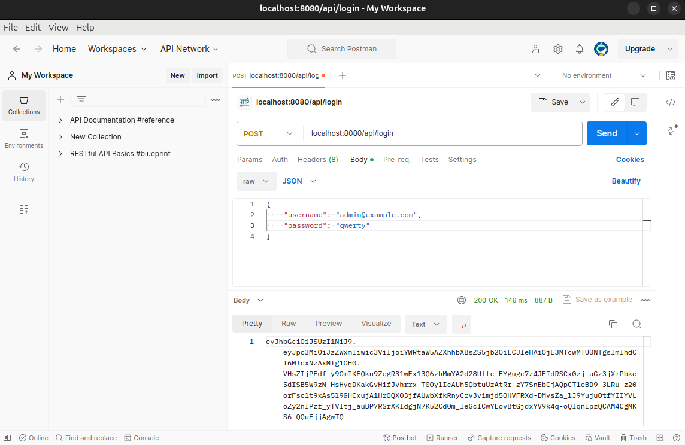
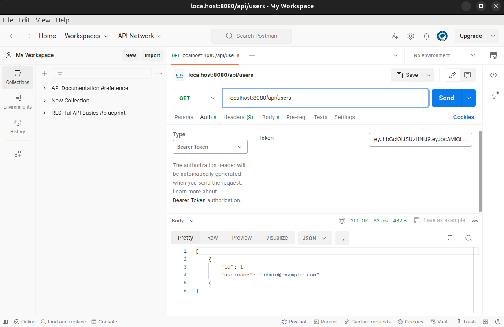
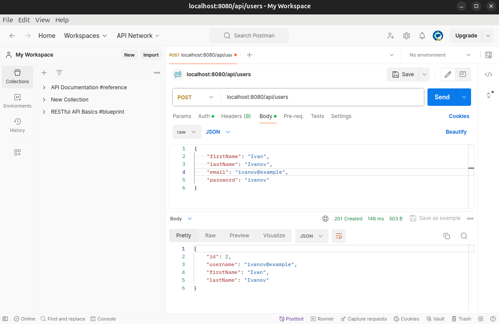
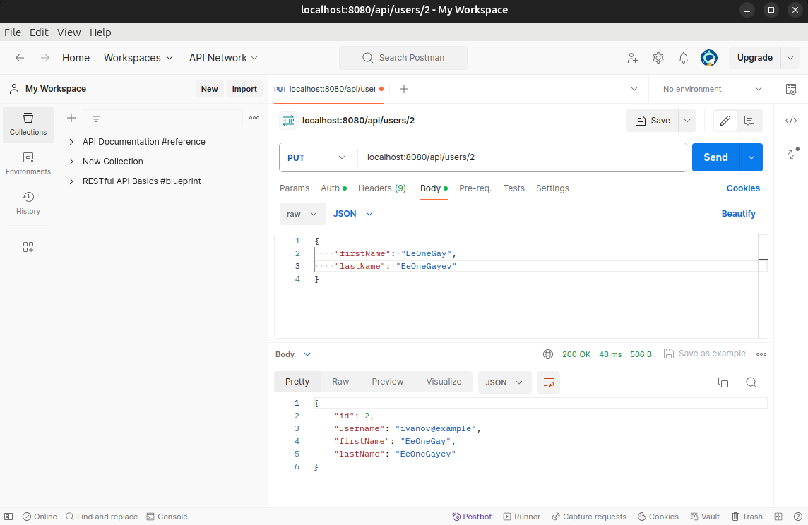
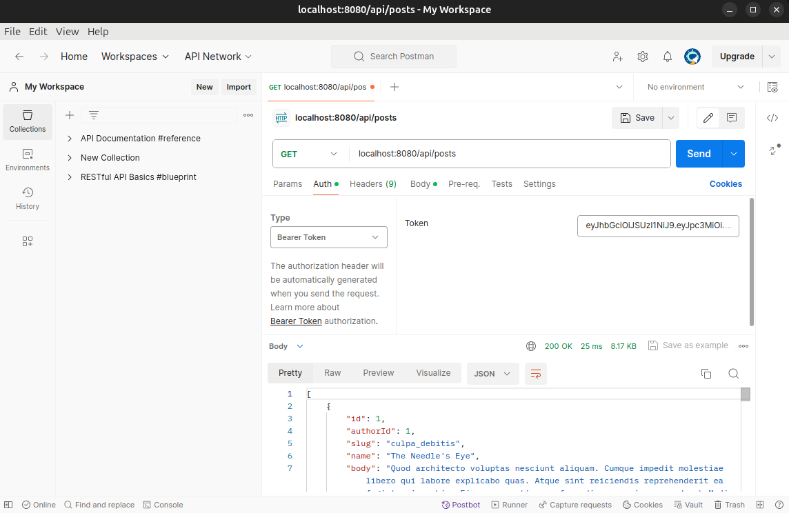
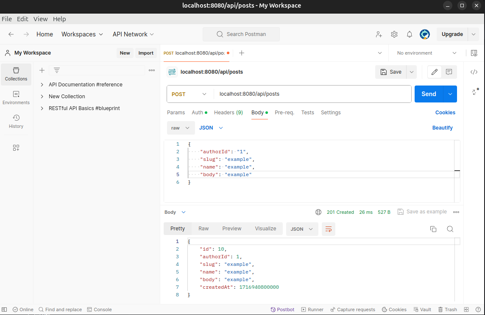
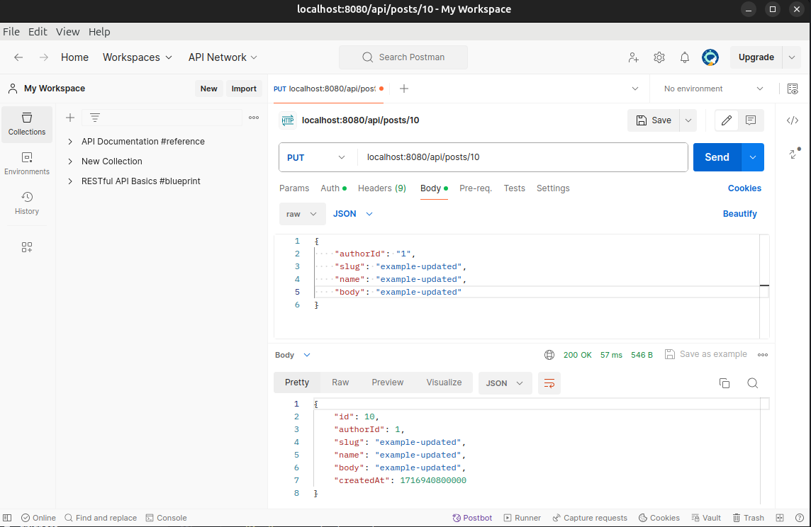

# BackendMySiteApi

### RESTFul API: CRUD implementation. User creation, update and deletion. Creating posts, updating them and deleting them. Authentication with JWT. Documentation OpenAPI, Swagger.

## Stack
REST API, Security, JWT, JPA, Hibernate, Docker, JUnit, Mockito, Instancio, Faker, Mapstruct, OpenAPI, Swagger, PostgreSQL, Sentry, Checkstyle, Lombok, Jacoco, Postman

## Demo

`http post localhost:8080/api/login`

`http localhost:8080/api/users`

`http post localhost:8080/api/users firstName=Ivan lastName=Ivanov email=ivanov@example password=ivanov`

`http put localhost:8080/api/users/2 firstName=EeOneGay lastName=EeOneGayev`

`http localhost:8080/api/posts`

`http post localhost:8080/api/posts authorId=1 slug=example name=example body=example`

`http put localhost:8080/api/posts/10 authorId=1 slug=example-updated name=example-updated body=example-updated`
